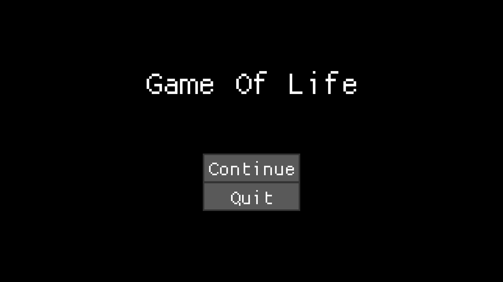
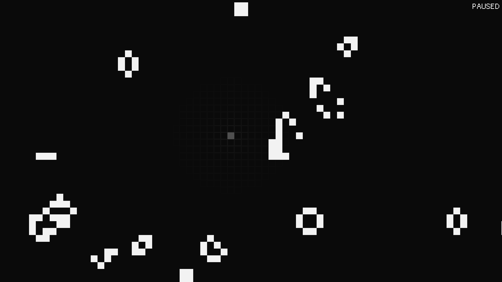

# Conway's Game Of Life implementation in Rust

* Can handle ~15k alive cells at 60 FPS on max speed on Intel Core i5-4440
* Universe of size 4x4 **billion** cells

## Controls:
* LMB - Revive cell
* RMB - Kill cell
* Shift+RMB - Kill radius of cells around cursor
* WASD *or* Ctrl+LMB *or* MMB - Move camera around
* R - Revive random cells around mouse cursor
* L - Revive straight line of cells
* N - Advance to next generation (only when paused)
* Ctrl+Shift+R - Reset everything
* Space - Pause game
* Ctrl+S - Save current state
* Esc *or* Q - Exit to main menu
* Arrow Up - Increase speed
* Arrow Down - Decrease speed
* Equal - Reset speed
* Scroll - Zoom in/out

* F1 - Show debug information

## Menu screenshot:

## Gameplay screenshot:
 
